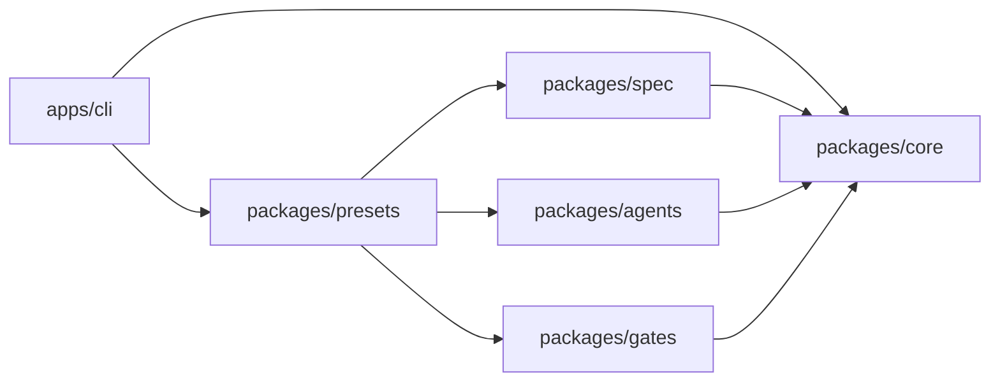

# Architecture Spine — Downstroke

## Design Paradigm

Functional core, imperative shell. Capability packages declare immutable plans and checks. `packages/core` inspects, plans, applies and verifies effects. `apps/cli` owns parsing, prompts, rendering and process exit codes.



## Invariants and Rules

### AD-1 — Effects belong to core [ADOPTED]

- **Binds:** FR1-FR3, FR24-FR34, all packages.
- **Prevents:** Each package inventing filesystem, process or verification behavior.
- **Rule:** Capability packages export data and pure composition. Only `packages/core` performs filesystem/process effects; only `apps/cli` interacts with the user.

### AD-2 — Every mutation uses one lifecycle [ADOPTED]

- **Binds:** All mutating FRs and NFR2-NFR3.
- **Prevents:** Silent writes, unverifiable success and inconsistent dry-run behavior.
- **Rule:** Mutations execute `inspect -> plan -> authorize -> apply -> verify`. Dry-run returns after `plan`. Verification failure never reports success.

### AD-3 — User-owned content is outside framework ownership [ADOPTED]

- **Binds:** FR1, FR32-FR33, FR68, NFR2-NFR3.
- **Prevents:** Framework upgrades overwriting user work.
- **Rule:** Files use copy-if-missing until explicit Managed Blocks exist. Managed Blocks update only matching owned regions; ambiguity stops the mutation.

### AD-4 — State is scoped to the resolved Git root

- **Binds:** FR6-FR16, NFR4.
- **Prevents:** Repository credentials, policy, reports or LLM context leaking across sibling repositories.
- **Rule:** Repository state lives in `<git-root>/.downstroke/`; workspace inventory lives in `<workspace>/.downstroke-workspace/`. Every mutation carries an explicit resolved root.

### AD-5 — Authorization is a scoped capability

- **Binds:** FR7-FR9, FR15-FR16, FR28, FR53-FR55, FR75, FR81.
- **Prevents:** Planning approval becoming blanket mutation authority.
- **Rule:** Authorization records operation, target and lifetime. Commit, push, credential removal, publish, production mutation and history replacement are separate capabilities; high-risk capabilities require fresh execution-time approval.

### AD-6 — Development provenance does not become a product dependency

- **Binds:** FR4, FR60-FR68, NFR35-NFR37.
- **Prevents:** Maintenance tooling, vendor names and external runtime assumptions leaking into installed Downstroke projects.
- **Rule:** External tools may support work inside the maintenance repository, but release manifests exclude their configuration, commands, names and runtime assumptions. Native Downstroke capabilities own shipped contracts. Existing project artifacts are read only through source-attributed migration paths and never remain permanent fallbacks.

### AD-7 — Provider integrations expose capabilities, not shared credentials

- **Binds:** FR17-FR26, FR35, FR41, FR53-FR55.
- **Prevents:** Provider coupling and secrets copied into repository state.
- **Rule:** Persist provider choice and non-secret configuration only. Credentials remain in provider/platform stores. Introduce a shared provider interface only when two implemented providers consume the same operation.

### AD-8 — Product data and visual rules each have one authority

- **Binds:** FR42-FR52, NFR24-NFR30.
- **Prevents:** Frontend/LLM authority over permissions, data, brand or copy.
- **Rule:** Application backend contracts own operational data and authorization. The neutral design system owns tokens/assets; localization catalogs own visible copy. LLM and platform files are generated projections.

### AD-9 — Release outputs are allowlisted and reproducible

- **Binds:** FR72-FR81, NFR39-NFR45.
- **Prevents:** Internal artifacts, secrets or unrecoverable history loss entering public releases.
- **Rule:** npm and public-repository contents derive from explicit Release Manifests and clean-fixture verification. Public history replacement is impossible until the full-history private remote is verified.

### AD-10 — Plan composition rejects ambiguous ownership

- **Binds:** Presets, Modules, Managed Blocks and all file plans.
- **Prevents:** Two independently built Modules silently writing incompatible content to one target.
- **Rule:** Operation IDs are namespaced by Module. Plan composition rejects duplicate targets unless operations are byte-equivalent or address distinct valid Managed Block IDs; conflicts never resolve by ordering.

### AD-11 — Persisted state is validated and atomic

- **Binds:** Project State and Workspace state.
- **Prevents:** Partial writes, incompatible schema versions and concurrent command corruption.
- **Rule:** Read state as `unknown`, validate its schema version, write through same-directory temporary files plus atomic replacement, and reject concurrent updates when the loaded revision is stale.

### AD-12 — Product conflicts require an owned human decision

- **Binds:** Planning, architecture, migration, security and all product-visible behavior.
- **Prevents:** An LLM, importer or deterministic workflow silently selecting one contradictory source and laundering that choice into project truth.
- **Rule:** When active sources disagree materially, record both sources and hashes, classify the decision owner, present options with consequences, and pause. Controlled mode persists the checkpoint and resumes only from an explicit decision. Deterministic merge is allowed only for non-semantic changes proven equivalent.

## Consistency Conventions

| Concern | Convention |
| --- | --- |
| Packages | `@downstroke/*`; CLI package owns the `downstroke` binary. |
| Types | `unknown` at external boundaries; strict narrowing; no `any`. |
| Results | Stable IDs plus `ok`, `warn` or `fail`; messages never carry secrets. |
| Paths | Store repository-relative POSIX paths; resolve absolute paths only at the effect boundary. |
| State | JSON under `.downstroke/`; schema-version every persisted document. |
| Mutations | Plan objects are serializable and are the source for human, JSON and dry-run output. |
| Errors | Expected failures become structured results; unexpected failures preserve a nonzero exit code. |
| Language | Active project artifacts, code, comments, identifiers and configuration are English. |

## Stack Seed

| Name | Version |
| --- | --- |
| Node.js | >=22 |
| TypeScript | strict, repository lockfile owns exact version |
| npm workspaces | repository lockfile owns exact version |
| Node test runner | Node >=22 |

## Structural Seed

```text
apps/cli/            # command parsing, prompts, rendering, exit codes
packages/core/       # effect lifecycle, inspection, plans, verification
packages/spec/       # canonical specification module assets
packages/agents/     # agent/rule module assets
packages/gates/      # deterministic readiness checks
packages/presets/    # pure module composition
.downstroke/         # repository-local state in consumer projects
.downstroke-workspace/ # workspace inventory outside repository state
```

## Capability to Architecture Map

| Area | Lives in | Governed by |
| --- | --- | --- |
| Init, doctor, checks | `core`, `cli`, `presets` | AD-1, AD-2, AD-3 |
| Git and multi-repo | `core`, `cli`, Project State | AD-2, AD-4, AD-5 |
| Stack/provider guidance | capability Modules, `presets` | AD-1, AD-7 |
| Design and localization | capability Modules | AD-8 |
| Native platform/runtime/registry | Downstroke-owned capability packages | AD-6 |
| npm/public release | release scripts and manifests | AD-5, AD-9 |

## Deferred

- Exact Project State schemas until their first implementing story.
- Provider interfaces until a second real implementation shares an operation.
- Database entities until a selected application workflow needs them.
- Agent runtime and registry protocols until normal functions and local modules prove insufficient.
- Public-release branch mechanics until the private maintenance remote and license are selected.
- Deployment topology for the future documentation site until that epic begins.
